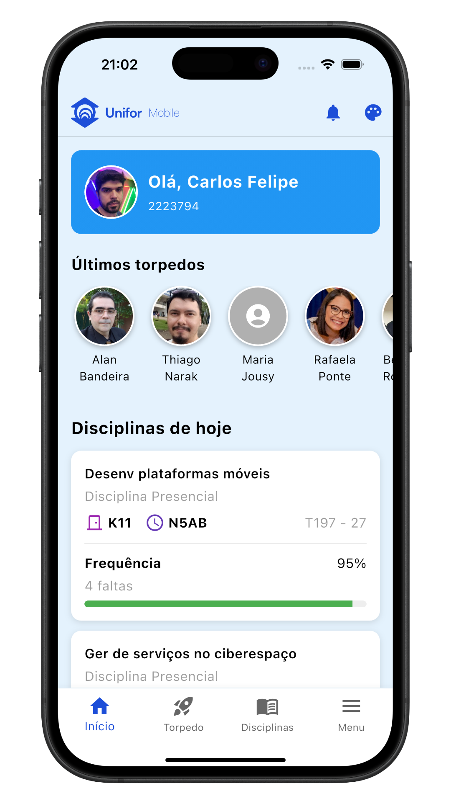
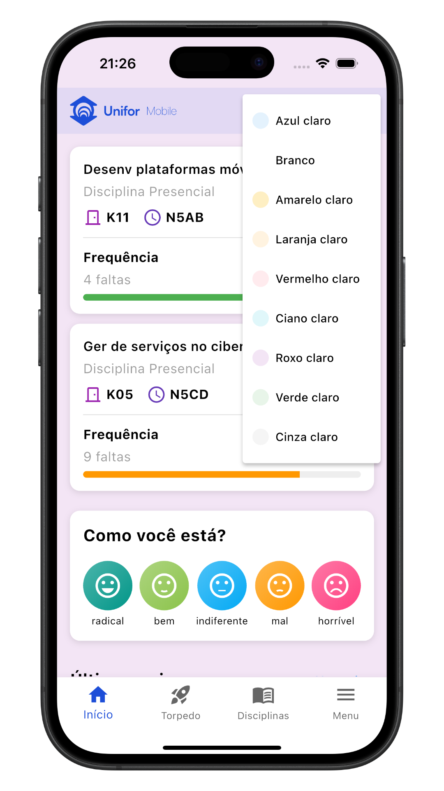
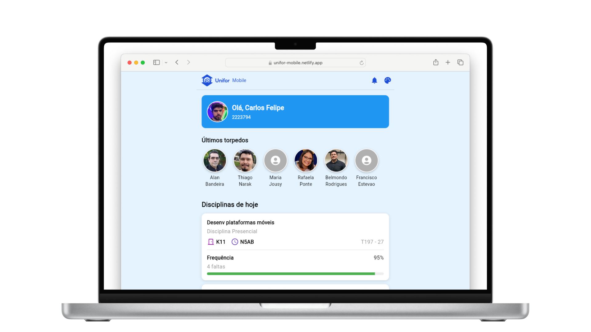

# Unifor Mobile (clone)

Criei um mock da tela inicial do app Unifor Mobile em Flutter, adicionando funcionalidades como suporte a temas e um card de bem-estar digital, entre outras melhorias.

<p align="center">
  <table>
    <tr>
      <td></td>
      <td></td>
    </tr>
  </table>
</p>

**Acesse a versão web:**  
[unifor-mobile.netlify.app](https://unifor-mobile.netlify.app/)

<p align="center">
  
</p>

## Como rodar este projeto

1. **Clone o repositório:**

   ```bash
   git clone git@github.com:carlosxfelipe/unifor-mobile.git
   cd unifor-mobile
   ```

2. **Instale as dependências:**

   ```bash
   flutter pub get
   ```

3. **Execute o projeto:**

   ```bash
   flutter run
   ```
